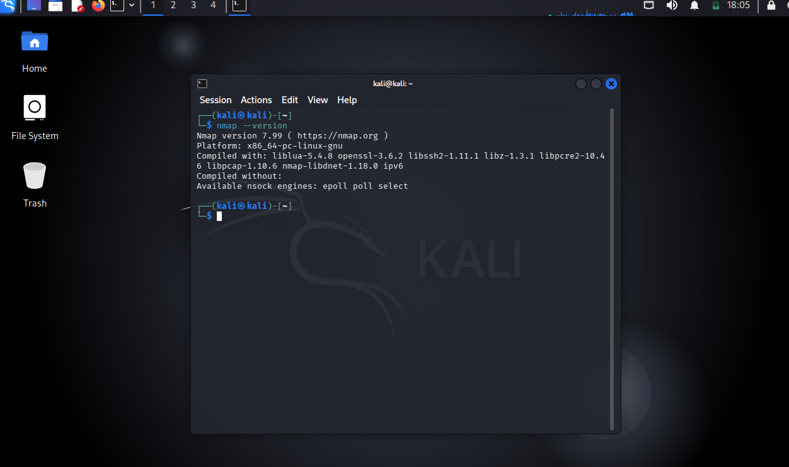
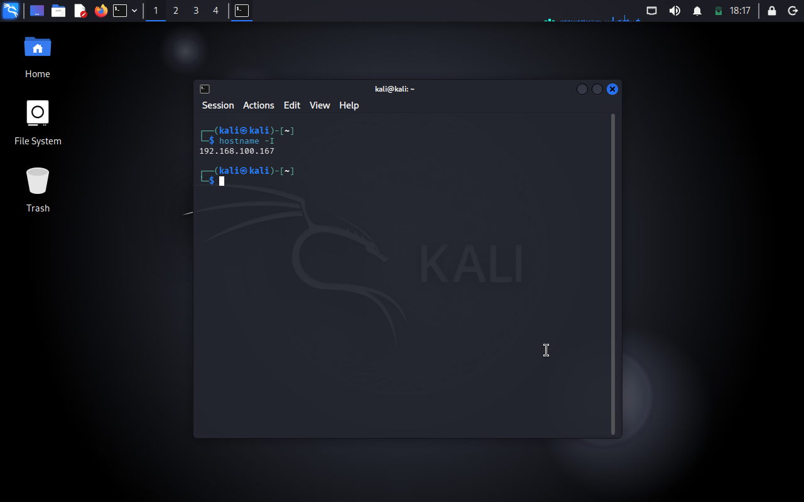
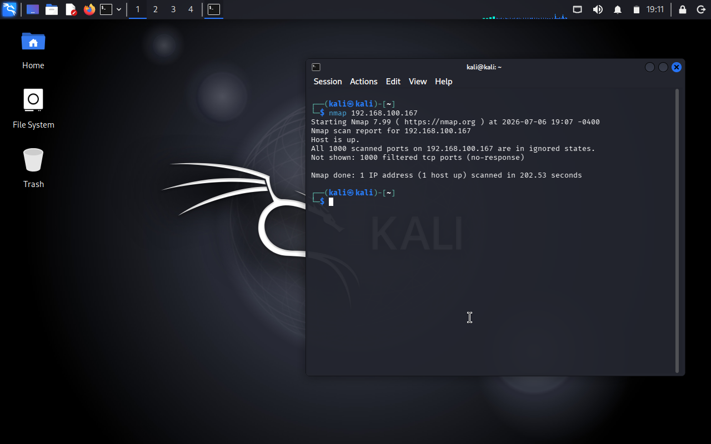
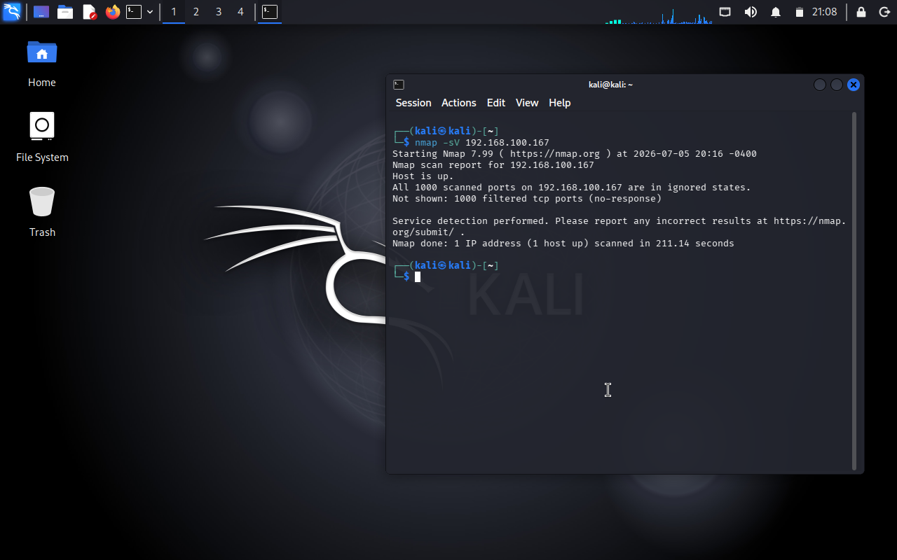
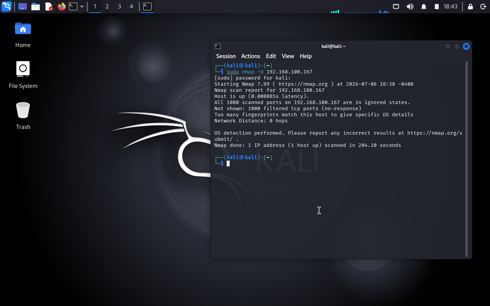

# Cyber Security Task 1 - Basic Network Scanning with Nmap

## Objective

The objective of this task is to perform a basic network scan using Nmap to identify active hosts, open ports, services, and operating system information.

---

## Tools Used

- Kali Linux
- Nmap
- VMware Workstation

---

## Commands Used

### 1. Check Nmap Version

```bash
nmap --version
```

### 2. Find Local IP Address

```bash
hostname -I
```

### 3. Basic Network Scan

```bash
nmap 192.168.100.167
```

### 4. Service Version Detection

```bash
nmap -sV 192.168.100.167
```

### 5. Operating System Detection

```bash
sudo nmap -O 192.168.100.167
```

---

## Scan Results

- Nmap version 7.99 was successfully verified.
- Local IP address was identified as **192.168.100.167**.
- The target host was reachable.
- All scanned ports were filtered.
- No active services were detected.
- Service version detection returned no running services.
- OS detection could not accurately identify the operating system because all ports were filtered.

---

## Screenshots

### Nmap Version



### Local IP Address



### Basic Network Scan



### Service Version Detection



### Operating System Detection



---

## Conclusion

This task demonstrated the use of Nmap for basic network scanning. The target host was successfully reached, but no open ports or active services were found because all scanned ports were filtered. As a result, operating system detection was inconclusive.
